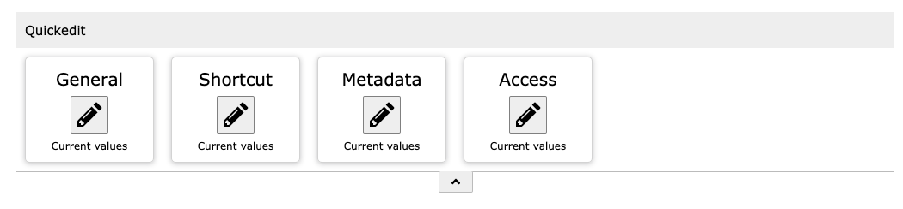
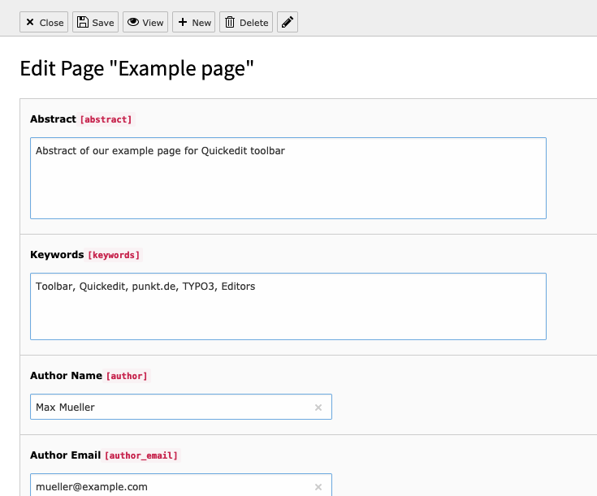
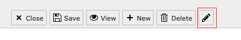
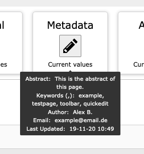
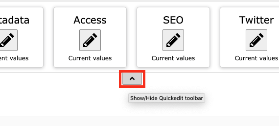
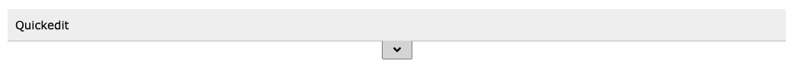
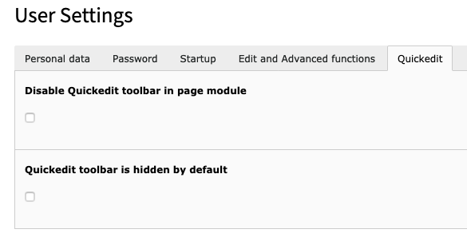

.. include:: ../Includes.txt

.. _for-editors:

===========
For editors
===========

This chapter describes how to use the toolbar from an editor point of view.

Toolbar
=======

Depending on the current page type the toolbar provides a number of fieldgroup edit buttons.

.. figure:: ../Images/Quickedit_Default-View.png
   :class: with-shadow
   :alt: Toolbar on default page
   :width: 300px

   Toolbar in page module on default page

   Toolbar in page module on shortcut page

Edit buttons
============

Clicking an edit button leads to a reduced view of the page settings, e.g. Metadata fields:

   Only Metadata fields are visible

From the reduced view you are able to switch to the full page settings by clicking
the small pen-icon next to the record buttons

   Button for edit all page settings

Field preview
=============

By hovering on the "Current values" text of a toolbar button a small preview tooltip of the most important
field values is displayed.
The preview does not necessarily show all fields which are editable by this button.

   A tooltip shows the values of some fields.

Toggle
======

By using the small arrow icon it is possible to hide/show the toolbar.
The status of the toolbar is saved for every page and has priority over the user settings configuration.

   Hide toolbar with toggle button.

   The closed toolbar in page module.

User settings
=============

In user settings there is an additional tab for the toolbar configuration.

Options:
    - Disable Quickedit buttons in page module
    - Quickedit buttons are hidden by default

