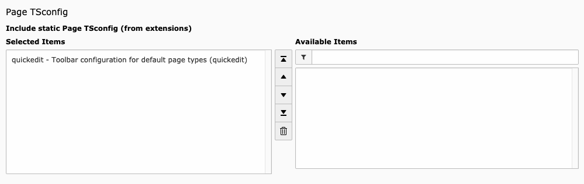

.. include:: ../Includes.txt

.. _installation:

============
Installation
============

#. Get extension 'quickedit'
    - Get it from https://extensions.typo3.org/extension/quickedit/
    - Get it from the Extension Manager in TYPO3 Backend
    - Get it with composer:

    .. code-block:: bash

        composer require punktde/quickedit

#. Install extension 'quickedit' in Extension Manager

Include page TSConfig (optional)
--------------------------------

Include Quickedit static page TSconfig on root page of your site.
This is not required but recommended for enabling the toolbar on default page types.

