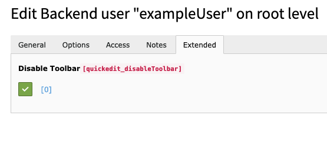
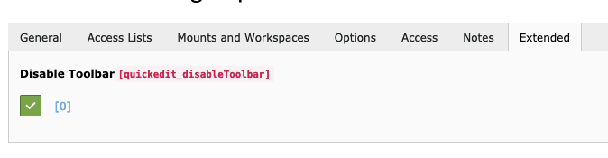

.. include:: ../Includes.txt

.. _for-integrators:

===============
For Integrators
===============

This chapter describes how to use the toolbar from an integrators point of view.

Disable Toolbar
===============

The toolbar can be disabled for a single backend user by checking the checkbox in user record.
It is located on the "Extended" tab.

To disable the toolbar for users of a group there is also a checkbox available in the usergroup record.
It is also located on the "Extended" tab.

