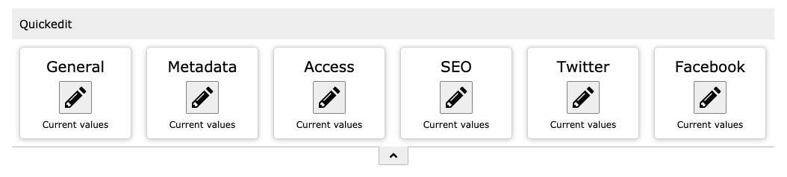

.. include:: ../Includes.txt

.. _introduction:

============
Introduction
============

.. _what-it-does:

What does it do?
================

This extension provides a configurable toolbar for editing page properties in the Page module.

Benefits of using this toolbar:

- Important fields are accessible via toolbar buttons, like the "General" button for page title, subtitle, slug etc.
- All other fields are not visible so there is no need to search for the correct tab and field.
- The toolbar can be defined as visible or hidden by default via the user settings.
- The toolbar can be deactivated by the user or via user or group settings.
- It is easily extendable via page TSConfig for integrators.

.. hint::
    The complete page settings are still accessible via the edit icon on top of the page view.

Screenshots
===========

   Toolbar in page module on default page
